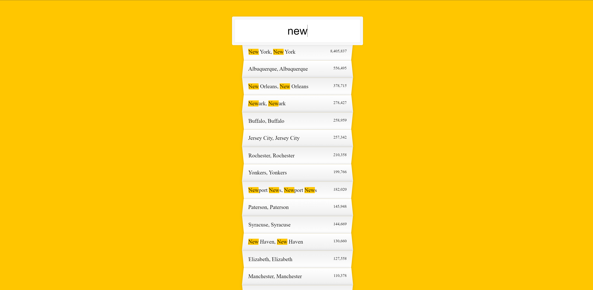

# JavaScript Type Ahead

## A Type Ahead JavaScript website to view city or state populations in the U.S.A.

This project was my sixth assignment within a 30 day JavaScript challenge. It utilises JavaScript to create an interactive user experience.

